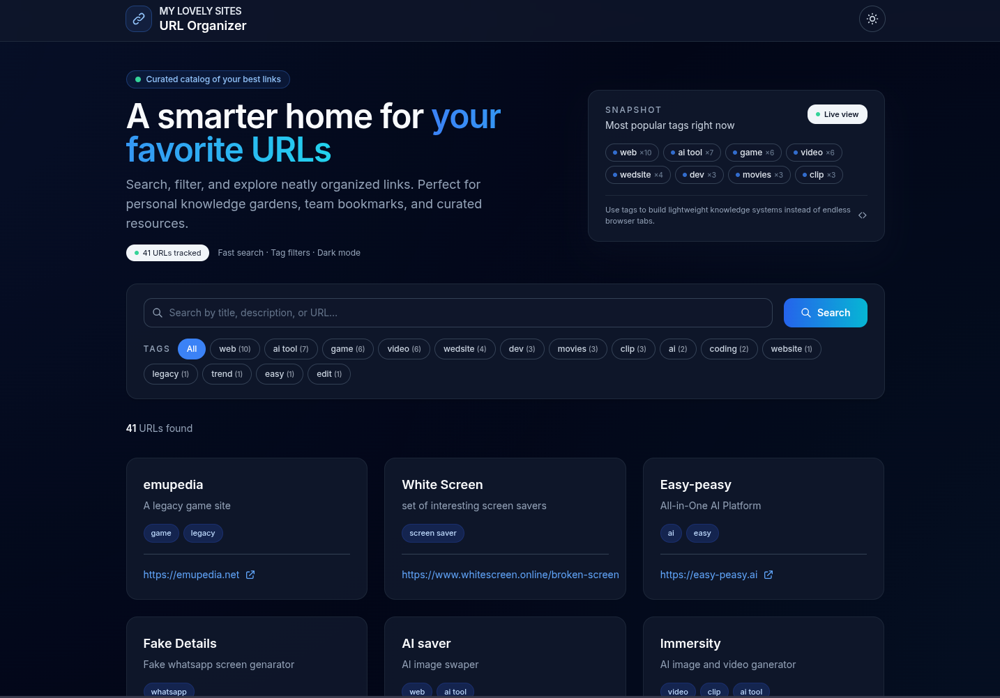
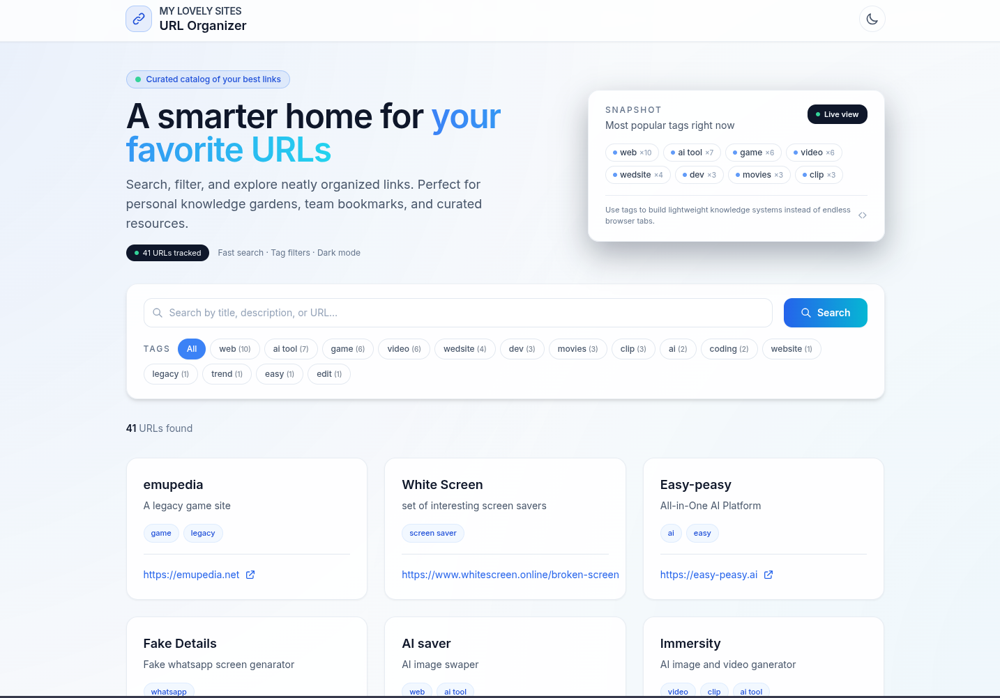

## URL Organizer

A minimal, production-ready Flask application for organizing and browsing curated URL collections, with a polished public catalog and an authenticated admin dashboard.

---

### Screenshots




---

### Features

- **Public URL catalog** – Responsive, searchable grid of organized URLs
- **Admin dashboard** – Secure login, CRUD UI, and statistics for URLs and tags
- **Collections & tags** – Group URLs into collections with subtitles and rich tagging
- **Full‑text search** – Search by title, description, and URL
- **Modern UI** – Tailwind‑powered layout, dark/light mode toggle, and clean admin table views
- **Production ready** – Environment‑based config, health check, security headers, and Atlas‑friendly MongoDB setup

---

### Tech Stack

- **Backend:** Flask (Python)
- **Database:** MongoDB (Atlas or local)
- **Views:** Jinja2 templates + Tailwind CSS (CDN) + Inter font
- **Auth:** Session-based admin login with Argon2 password hashing

---

## Getting Started

### Prerequisites

- Python 3.8+
- MongoDB (local instance or MongoDB Atlas cluster)

### Installation

1. **Clone the repository**
   ```bash
   git clone https://github.com/<your-org-or-user>/<your-repo>.git
   cd my-lovely-sites
   ```

2. **Create and activate a virtual environment**
   ```bash
   python -m venv venv
   source venv/bin/activate  # Windows: venv\Scripts\activate
   ```

3. **Install dependencies**
   ```bash
   pip install -r requirements.txt
   ```

4. **Configure environment variables**
   ```bash
   cp .env.example .env
   ```

   Update `.env` with your own values (see *Environment Variables* below).

5. **Generate admin password hash**
   ```bash
   python scripts/hash_password.py
   ```
   Paste the generated hash into `ADMIN_PASSWORD_HASH` in `.env`.

6. **Run the application (development)**
   ```bash
   python run.py
   ```

   The app will be available at http://localhost:5000.

---

## Usage

### Public catalog

- Visit `/` to browse the URL catalog
- Search by title, description, or URL
- Filter by tags using the tag pills
- Open links in a new tab from each card

### Admin dashboard

- Visit `/admin/login` and sign in with the admin credentials defined in `.env`
- Manage URLs and collections at `/admin`:
  - Create, edit, and delete URL collections
  - Attach multiple URLs and subtitles to a single collection
  - Tag URLs and filter by tags
  - View basic stats: total URLs, tags, and current filtered count

---

## Project Structure

```text
my-lovely-sites/
├── app/
│   ├── __init__.py          # Flask app factory
│   ├── config.py            # Configuration (dev/production)
│   ├── db.py                # MongoDB connection and index management
│   ├── repositories/
│   │   └── url_repo.py      # URL repository abstraction
│   ├── routes/
│   │   ├── public.py        # Public/catalog routes
│   │   ├── admin.py         # Admin dashboard routes
│   │   └── auth.py          # Authentication routes
│   ├── services/
│   │   ├── auth_service.py  # Auth and password logic
│   │   └── url_service.py   # URL business logic
│   └── templates/
│       ├── base.html        # Shared layout, nav, and theme toggle
│       ├── index.html       # Public catalog
│       ├── login.html       # Admin login
│       ├── dashboard.html   # Admin dashboard
│       └── url_form.html    # Create/edit URL collections
├── api/
│   └── index.py             # Vercel serverless entrypoint
├── scripts/
│   ├── hash_password.py     # Generate Argon2 password hashes
│   ├── seed_data.py         # Seed sample data
│   └── fix_url_index.py     # Ensure correct MongoDB indexes
├── .env.example             # Environment variable template
├── DEPLOYMENT.md            # Detailed deployment options and examples
├── PRODUCTION.md            # Production hardening and Ops notes
├── requirements.txt
├── run.py                   # Local dev entrypoint
└── vercel.json              # Vercel configuration
```

---

## Environment Variables

These are read from `.env` in development and from the process environment in production.

| Name                | Required | Description                                      |
|---------------------|----------|--------------------------------------------------|
| `MONGO_URI`         | Yes      | MongoDB connection string (Atlas recommended)   |
| `SECRET_KEY`        | Yes      | Flask secret key for sessions and CSRF          |
| `ADMIN_USERNAME`    | Yes      | Admin login username                             |
| `ADMIN_PASSWORD_HASH` | Yes   | Argon2 hash generated by `scripts/hash_password.py` |
| `FLASK_ENV`         | No       | `development` or `production`                   |
| `PORT`              | No       | Port for some deployment targets (default 5000) |

See `.env.example` for a documented template.

---

## Deployment

This project is designed to run both on traditional servers and on serverless platforms like Vercel.

- For a step‑by‑step Vercel, Railway, Render, and Docker walkthrough, see:
  - DEPLOYMENT.md – platform‑specific deployment guide
  - PRODUCTION.md – production configuration and hardening

At a high level you will need to:

1. Provision a MongoDB database (MongoDB Atlas is recommended).
2. Set all required environment variables on your hosting platform.
3. Build and start the app using Gunicorn or the provided serverless entrypoint.

---

## Contributing

Contributions, bug reports, and feature requests are welcome.

Please read CONTRIBUTING.md for:

- Local development workflow
- Code style and formatting
- How to propose changes (issues & pull requests)
- Recommendations for adding tests and docs

---

## Security

- Never commit real secrets or production `MONGO_URI` values to the repository.
- Always use a strong, unique admin password and rotate `SECRET_KEY` in production.
- If you discover a security vulnerability, please reach out privately to the maintainer instead of opening a public issue first.

---

## License

Specify your project license here (for example, MIT, Apache 2.0, etc.) and add a matching `LICENSE` file in the repository root.
